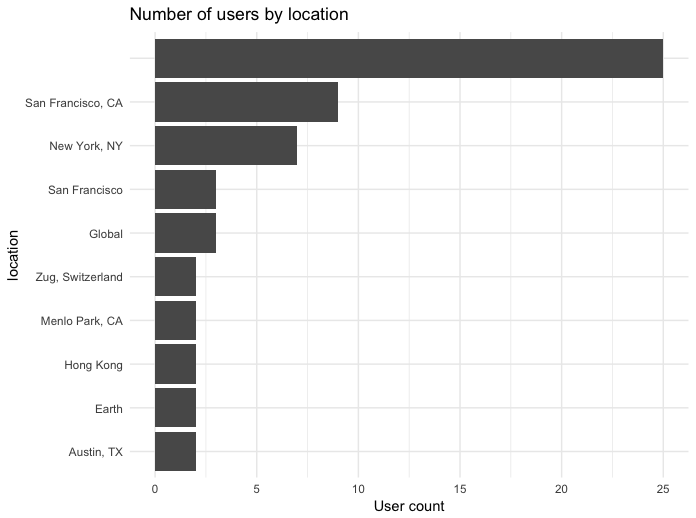
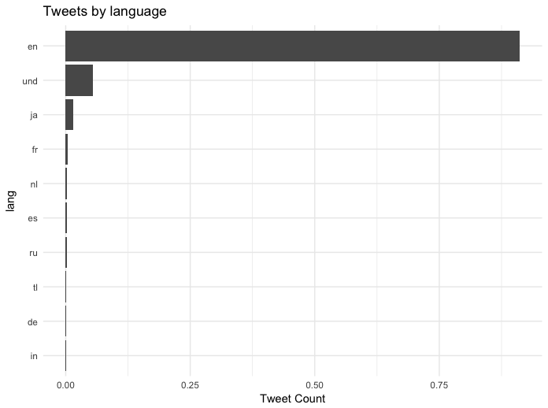
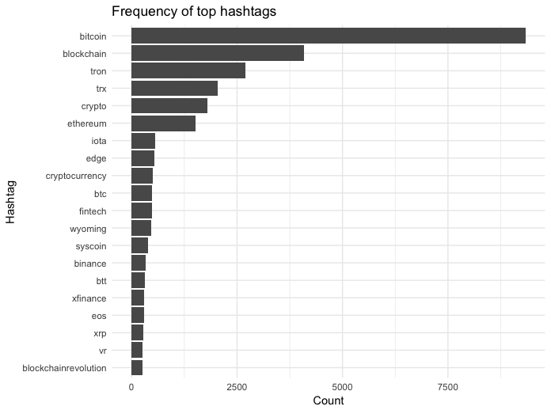
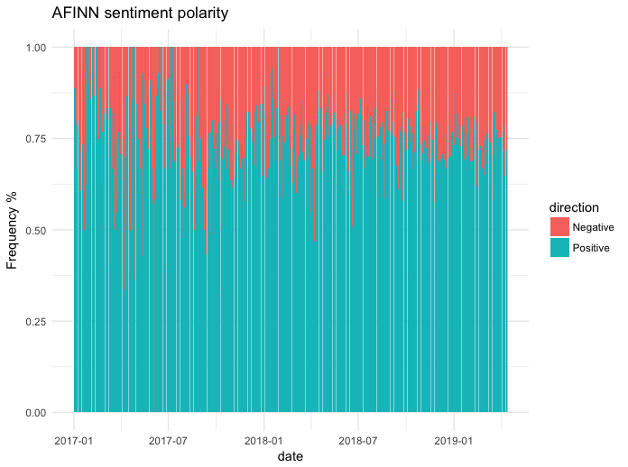
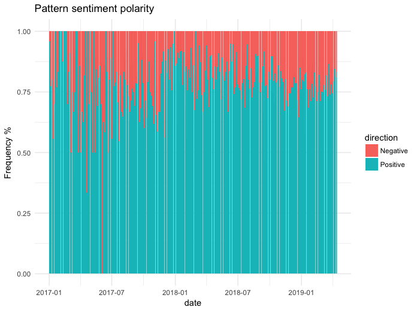
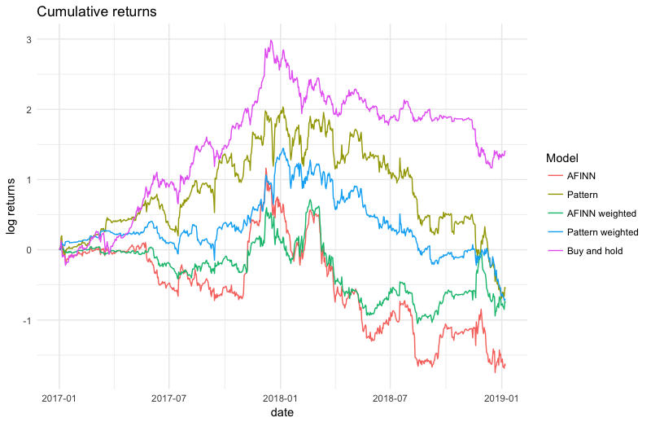
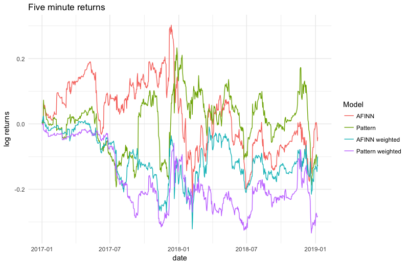

# Using Tweets to trade Bitcoin

Thought: Can Twitter sentiment be used to profitably trade Bitcoin?

tldr: No because people only tweet positive things about Bitcoin.

### Predictable inefficiencies

The best way to be successful over a prolonged period of betting or financial trading is to identify the given extent to which a game or market is inefficient and then capitalising by finding a method of exploiting the inefficiency. Clearly most of the low hanging fruit has long been gobbled up and some of the more complex market inefficiencies pounced on by high-frequency algorithmic trading firms which are tricky for a single individual to compete against; but it's possible that mispricing inefficiencies that individuals can take advantage of still exist for less liquid markets where information flows much slower, such as cryptocurrencies.

There has already been a number of papers showing that external influences can have a significant impact on the price of cryptocurrencies, such as [showing how much of the rise in Bitcoin can be accounted by Tether][1], so I've decided to take a look at whether influential contributors on Twitter are also able to abnormally impact the price of Bitcoin. 

If I am able to observe such an inefficiency, the method of exploitation would be to stream the tweets from these users and execute trades through an exchange's API after a mispricing opportunity arises. But let's worry about this part when we get to it.

### Collecting the data

#### Tweets
First task is to identify who are the users on Twitter who have the highest likelihood of moving Bitcoin prices through the power of their Tweets. Fortunately, [Cryptoweekly](https://cryptoweekly.co/100) has curated a list of who they believe to be the 100 most influential people in crypto, so this looks like a good place to start.

We can then use the Twitter API to loop through the list of users and extract their timelines, which I've chosen to do using the `rtweet` library. This will allow us to not only look at the text of the tweets, which we'll be calculating a sentiment score on, but also a lot of other metadata which we might find interesting. 

One of the biggest limitations getting timelines from the Twitter API is only being able to retrieve the last 3,200 posts for each user. This leads to fewer tweets being available for the more active users the further back in time we go, but even with this issue we should still be able to capture enough tweets to determine whether there is any merit to my initial question of whether tweets can be used as an indicator of future short term bitcoin movement.

#### Prices
The second dataset required to determine whether tweets can impact prices is of course price data. [bitcoincharts.com](https://api.bitcoincharts.com/v1/csv/) has a fairly robust collection of tick data from a number of  exchanges in a number of different currencies, going back far enough to be of use. I decided to use the Coinbase USD price data as this exchange has been one of the more reputable, longer lasting exchanges in the crypto space so it seemed as good as any. 

Arbitrages have long been known to exist amongst different bitcoin exchanges for various reasons such as security or trustworthiness. For example when the comparatively venerable CME launched trading Bitcoin futures the premium required to buy the futures was in the thousands of Dollars against the underlying product that the futures contract would have been marked against at expiry. Because of this nature of arbitrage, using one exchange seems preferable to amalgamating a number of them and selecting the best price upon which to analyse the impact of the tweets. Something to look into in the future though is just how great these arbitrage opportunities have been historically and what's changed as Bitcoin has become more mainstream with more institutional money behind it.

### Exploring the data

#### Tweet metadata
The tweet data obtained from the Twitter API contains a large amount of metadata, some of which may be useful and some not so. First, we'll take a closer look at the users whose tweets we are investigating.

38% of the accounts are currently (or at least as of their last tweet) verified by Twitter, so a decent chunk of them have enough public interest for Twitter to deem them worth of the little blue tick. This should hopefully be beneficial in determining whether their tweets have any real world influence on crypto pricing.

The location metadata attached to these tweets isn't hugely informative due to a number of the accounts not including any location indicator, but if we investigate the locations that are included, the majority of accounts appear to tweet from San Francisco followed by New York. It could be possible that tweets in some timezones have more influence on crypto trading activity than others, but then again other factors such as volume would similarly be lower in say Asian hours if we are to believe the majority of market participants are based in San Francisco.

  

Following on from location, what language the tweets were written in will also be useful to know before diving in to the sentiment analysis.

  

91% of the tweets say they are written in English, with the next most frequent being unidentified. Based on this, we should be able to get away with just using the English language parts of the sentiment lexicons.

Next, let's take a look at the hashtags that accompany each tweet.

  

After converting everything to lowercase, `#bitcoin` is far and away the most used hashtag, followed by `#blockchain`. This is what I would have expected before beginning any analysis. Slightly less expected is the prominence of the hashtags for the cryptocurrency TRON or TRX.

Perhaps unsurprisingly, 99% of the TRON or TRX hashtags come from user `justinsuntron`, one of the TRON founders. Given this, I'm sure it'll be fine to discount the apparent popularity of TRON that we initially observed by looking at the hashtags.

| Username | Tweet Count | Frequency |
|-----------------|-------------|-----------|
| justinsuntron | 2896 | 0.986 |
| SHERM8N | 7 | 0.002 |
| RichardHeartWin | 6 | 0.002 |
| officialmcafee | 5 | 0.002 |
| haydentiff | 4 | 0.001 |

#### Sentiment

The first sentiment analysis I'll perform on the tweets will be using the AFINN lexicon from the `tidytext` library. This lexicon assigns each word a polarity score between -5 and +5 depending on how positive of negative the word is.

  

An initial look at the sentiment scores shows a potential issue in that this group of crypto Tweeters appear to overwhelmingly write positively about cryptocurrencies regardless of what the underlying market is doing. After filtering the tweets to only look at the ones which contain `'bitcoin', 'btc', 'crypto', 'blockchain'` (as previously identified by looking into the hashtags), as can be seen in the plot below. 75% of tweets on any given day have positive sentiment, ignoring those with zero sentiment.

Let's try using another sentiment library to see if the picture is still the same. The `pattern` library in Python is a good choice which has been used for similar Twitter analysis, [but in trying to predict stock market moves][2]. This lexicon gives a sentiment polarity score between -1 and +1, but also gives a subjectivity score between 0 and 1 which aims to quantify whether the text is factual or opinion.

  

This sentiment lexicon indicates that 80% of tweets on a given day are positive. So whatever lexicon is used, it's fair to say that the group of 100 users suggested by Crypto Weekly as the most influential don't like to talk badly about the industry.

### Model
So, on to trying to see whether there are any exploitable patterns to be found. One thing 'make you rich quick buy it off the shelf' algorithms targeted at retail traders have the tendency of doing is overfitting historic data to make past returns look fantastic, then the returns fall off of a cliff after an unsuspecting victim switches it on for themselves. This is clearly something to be wary of in making the model too complex and based on metrics that help returns but have little theoretical reasoning for being included. 

The simple model will look at the total sentiment in a 5 minute bucket, buying Bitcoin if it's positive and selling if it's negative and holding for one hour before it is closed. A second model weighted by the number of interactions the tweet has had (retweets and favourites) will be along the same lines but buys if the bucketed sentiment is over a set cutoff level.

The base case that the models will be marked against will be the daily returns of a simple buy and hold model. A buy and hold model will obviously look great on the huge price growth seen in 2017, but hopefully Twitter sentiment is able to pick out good opportunities to trade when the price movement is less one directional. We'll start from the simplest model of purely looking at the price action following tweets, and then moving on to looking whether scaling by things such as number of retweets or favourites helps at all. The model will initially assume transaction costs are zero, which is obviously an incorrect assumption, but they'll be factored in down the line should the initial model look promising

One potential issue with scaling tweets sentiment by the number of retweets and favourites they receive is the potential for the buy-and-hold crypto majority to only interact with tweets that agree with their positive opinion. However, the significance of the regression between the sentiment of a tweet and the number of interactions it receives is so small that it can be ignored.

  

The results don't look good. Any way it's cut seems to suggest that trading bitcoin based on the sentiment of popular members of the crypto crowd on Twitter underperforms simply buying and holding, both in the bitcoin boom of 2017 and the bust of 2018. What I suspect is occurring is that during 2017, there were not enough tweets to encourage participation in trading through sentiment to keep up with Bitcoin's meteoric rise; and then tweets were far too complimentary regarding cryptocurrencies during the crash and so also performed terribly. Weighting the tweets seems to do little asides from dampening the unweighted results. The Pattern sentiment lexicon seems to far outperform AFINN, which is possible due to the number of tweets being determined as 'positive' being greater using the pattern lexicon as described previously.

| Year|Model            | Total returns| Average daily returns| Standard deviation| Maximum drawdown|
|----:|:----------------|-------------:|---------------------:|------------------:|----------------:|
| 2017|AFINN            |        0.6659|                0.0018|             0.0579|          -0.8305|
| 2017|Pattern          |        1.9330|                0.0053|             0.0618|          -0.7893|
| 2017|AFINN weighted   |        0.1476|                0.0004|             0.0426|          -0.5261|
| 2017|Pattern weighted |        1.3599|                0.0037|             0.0400|          -0.5531|
| 2017|Buy and hold     |        2.6363|                0.0072|             0.0488|          -0.4502|
| 2018|AFINN            |       -2.2685|               -0.0062|             0.0731|          -2.4143|
| 2018|Pattern          |       -2.6285|               -0.0072|             0.0742|          -2.7301|
| 2018|AFINN weighted   |       -0.9377|               -0.0026|             0.0597|          -1.7656|
| 2018|Pattern weighted |       -2.0194|               -0.0055|             0.0557|          -2.1055|
| 2018|Buy and hold     |       -1.3231|               -0.0036|             0.0438|          -1.6812|

It is also possible that the tweets only have a short term impact on price before reverting, which can't be captured by looking at the movement over an hour as described above. But this also doesn't seem to be true. As the chart below shows, trading over a five minute window based on the sentiment of tweets follows somewhat of a random walk with no great expectations of ever turning this model into a consistently profitable strategy.

  

### Conclusions
Going back to the original question as to whether we can use sentiment from the tweets of popular members in the crypto community to create a profitable trading strategy, the initial answer appears to be no. One of the biggest issues is that this particular group of Twitter users appear to overwhelmingly write positively regarding cryptocurrencies

Sure there are other ways to tackle the problem that may lead to a different conclusion, something that I may look back into down the line. For example generating my own list of Twitter users to analyse rather than take a list from a source that is likely to be happier to see cryptocurrencies succeed. Then there is also different ways to tackle the model, digging in deeper than the relatively simplistic methods above, for example analysing the text of the tweets in greater detail rather than just looking at the generic sentiment or finding a better way to weight tweets which gather more traction. However, as mentioned previously, we would need to be wary of overfitting by simply throwing a large number of models at the problem until one of them stick. Another cryptocurrency, such as Ripple which is renowned for having a [vocal Twitter following](https://twitter.com/hashtag/xrparmy), could also be looked into to try and find out whether the results are more significant.

[1]: https://papers.ssrn.com/sol3/papers.cfm?abstract_id=3195066 "Is Bitcoin Really Un-Tethered?"
[2]: http://alo.mit.edu/wp-content/uploads/2017/03/Wisdom-of-twitter-crowds.pdf "Wisdom of Twitter crowds"
